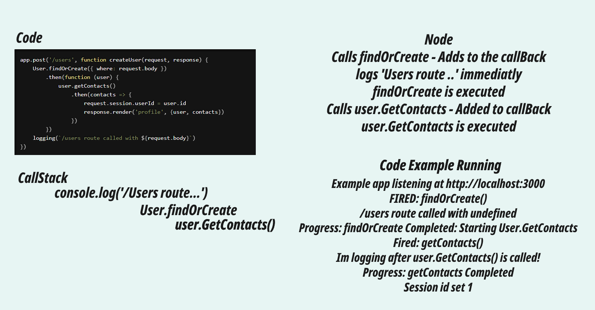

# JS---Event-Loop-Express-Example

# Event Loop

Example code runnig in express to show the code execution order of a dummy project.

> npm install
> npm run start

When the side is running and the post address is hit, it will output to the console the order of code being hit, console logs are at the start and end of each method.

Async methods are returning promises so will be placed in the queue -  you will see logs in the console executing before these finish, demonstrating the order of execution.

An excellent ref on how it actually works in depth:

https://dev.to/lydiahallie/javascript-visualized-promises-async-await-5gke

